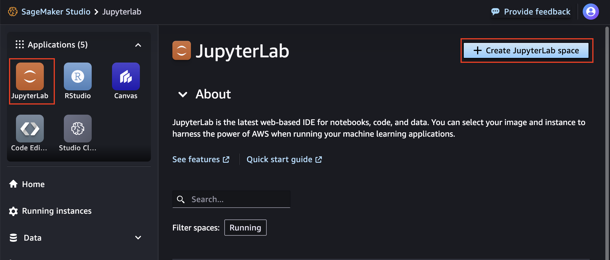
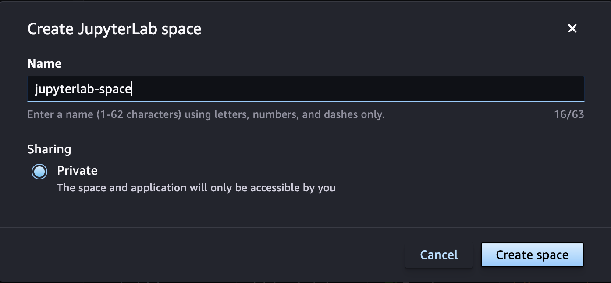
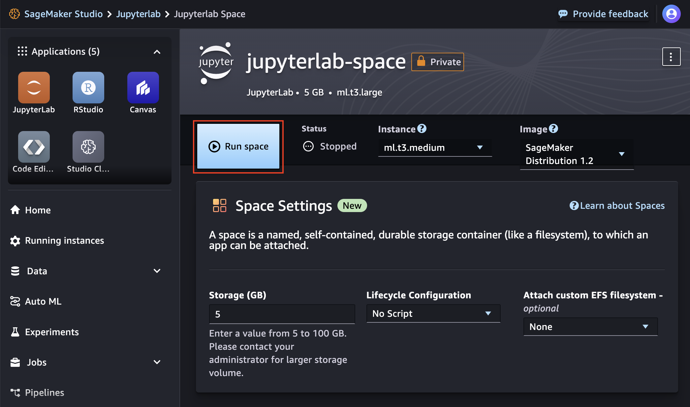
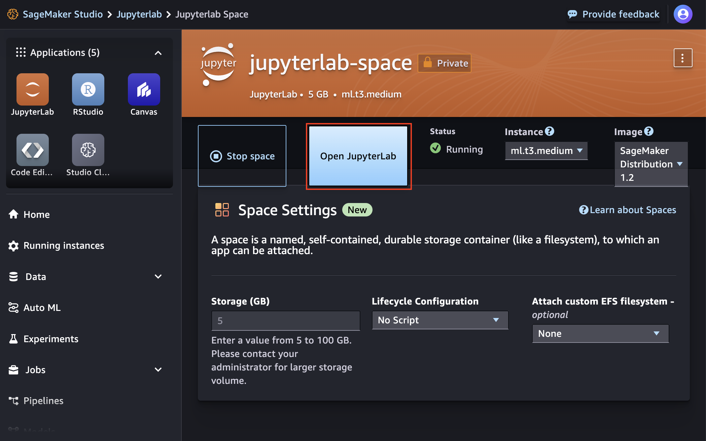
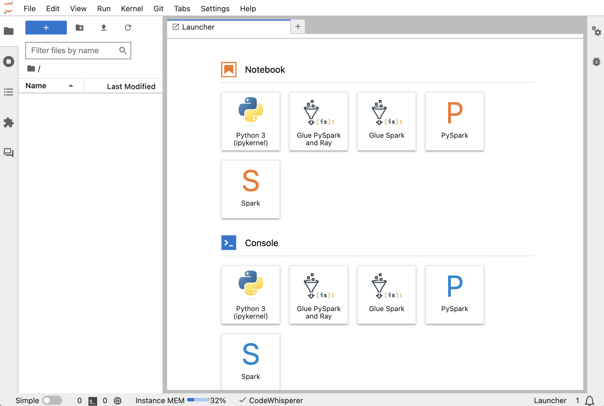
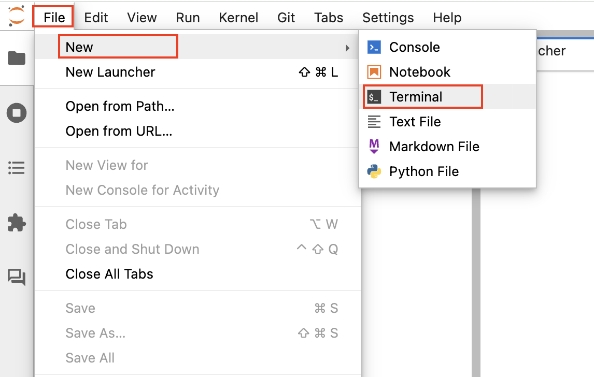
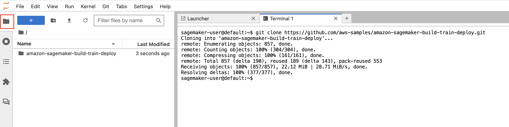
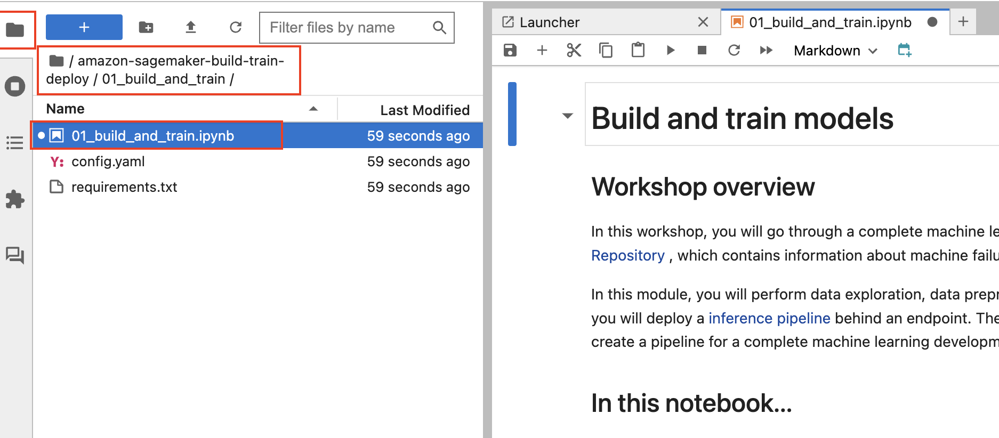

# Module 2: Deploy the models

In this module, you will create a Code Editor space in SageMaker Studio and clone this GitHub repository in the Code Editor environment. You will then deploy the trained models to a SageMaker inference endpoint using a deployment script written in Python.

 In this module, you will use the [Code Editor](https://docs.aws.amazon.com/sagemaker/latest/dg/code-editor.html), based on [Code-OSS, Visual Studio Code - Open Source](https://github.com/microsoft/vscode#visual-studio-code---open-source-code---oss), which allows you to write, test, debug, and run your analytics and machine learning code using the popular lightweight IDE. Code Editor is fully integrated with Amazon SageMaker Studio and supports IDE extensions available in the Open VSX Registry.

## Create a Code Editor space in SageMaker Studio

1. Launch the Code Editor application by clicking on the **Code Editor** button under **Applications**, then choose **Create JupyterLab space**.  



2. In the "Create JupyterLab space" dialog box, enter a name for the new space, such as `jupyterlab-space`. Then choose **Create space**.



3. A new page shows the settings for the new JupyterLab space you created. Wait for a few seconds until the **Run space** button becomes active. Then run the space.  



4. Choose the **Open JupyterLab** when it appears.



5.  The JupyterLab IDE will load. 




## Clone the GitHub repository

1. In the **File** menu, choose **New >> Terminal**

	

	This will open a terminal window in the Jupyter interface.

2. Execute the following command in the terminal:

	```
	git clone https://github.com/aws-samples/amazon-sagemaker-build-train-deploy.git
	```

    The cloned repository folder will appear in the file browser panel as shown below:
    
    
	

## Open Module 1 notebook in JupyterLab IDE

1. Browse to the folder **01_build_and_train** , open the notebook **01_build_and_train.ipynb** and continue follow the instructions in the notebook.

