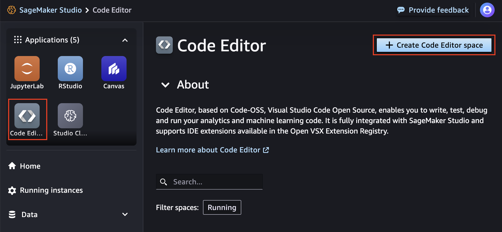
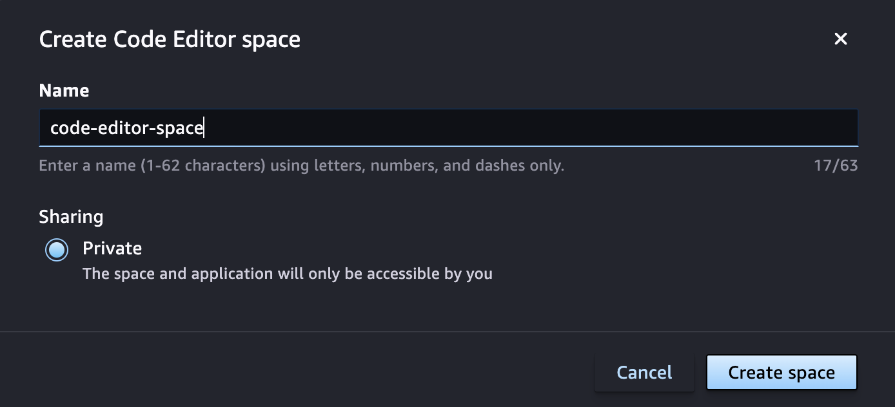
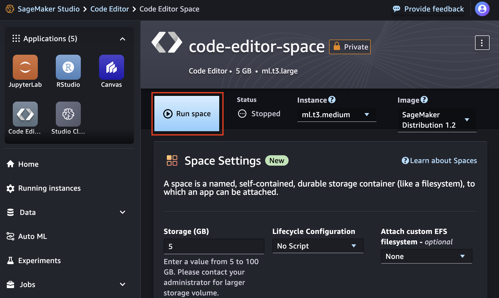
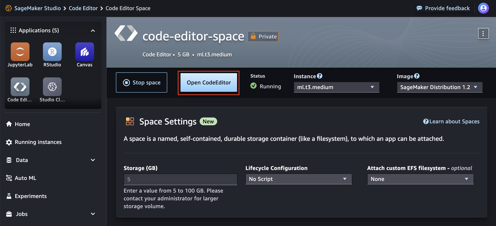
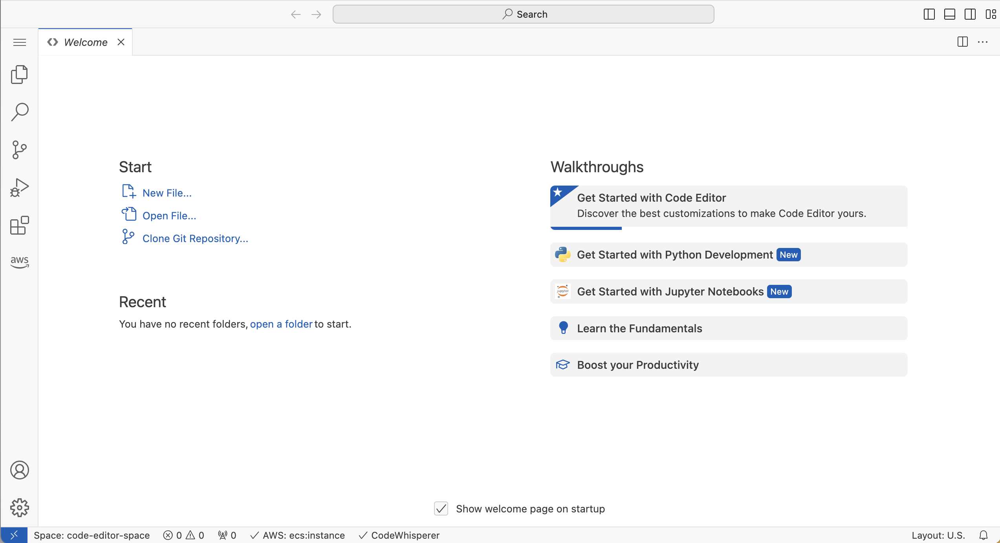
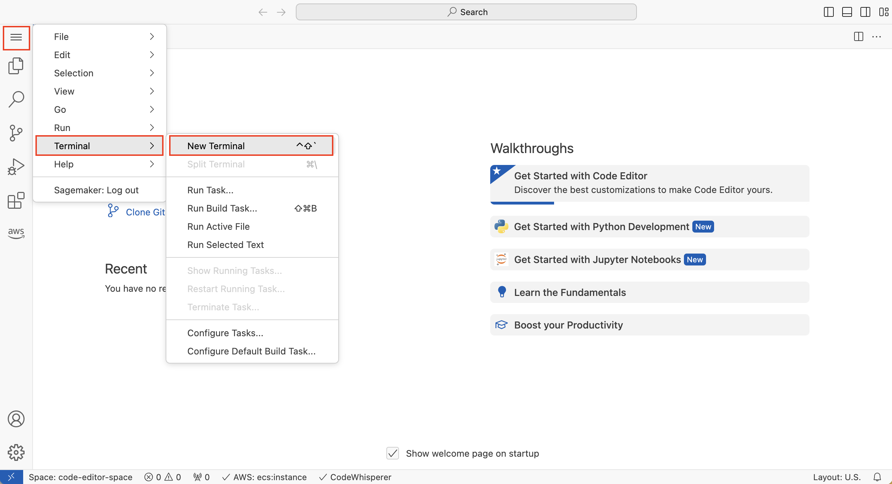
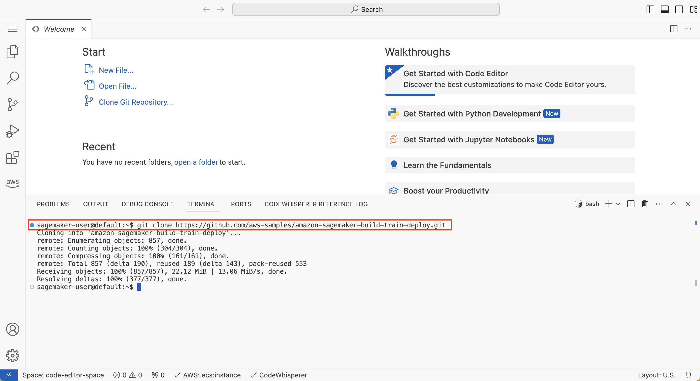
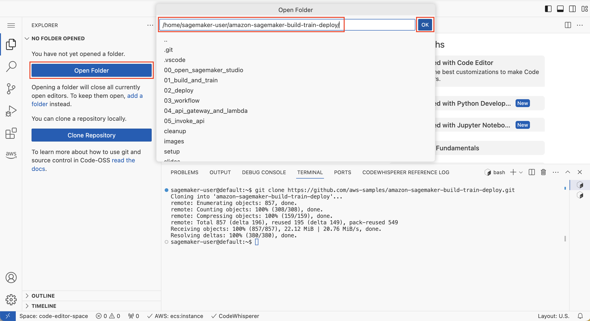
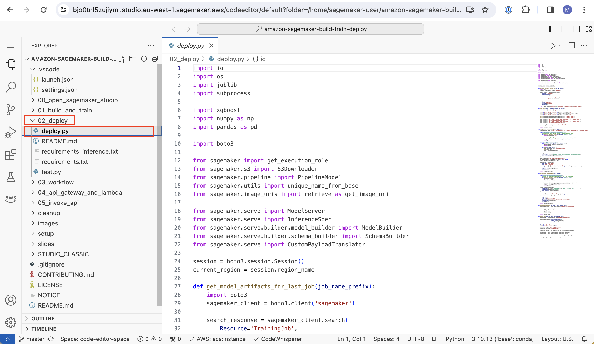

# Module 2: Deploy the models

In this module, you will create a Code Editor space in SageMaker Studio and clone the GitHub repository, this time in the Code Editor environment. You will then deploy the trained models to a SageMaker inference endpoint using a deployment script written in Python.

The [Code Editor](https://docs.aws.amazon.com/sagemaker/latest/dg/code-editor.html), which is based on [Code-OSS, Visual Studio Code - Open Source](https://github.com/microsoft/vscode#visual-studio-code---open-source-code---oss) and fully integrated with SageMaker Studio, allows you to write, test, debug, and run your analytics and machine learning code using the popular lightweight IDE.

## Create a Code Editor space in SageMaker Studio

1. Launch the Code Editor application by clicking on the **Code Editor** button under **Applications**, then choose **Create Code Editor space**.  



2. In the "Create Code Editor space" dialog box, enter a name for the new space, such as `code-editor-space`. Then choose **Create space**.



3. A new page shows the settings for the new JupyterLab space you created. Wait for a few seconds until the **Run space** button becomes active. Then run the space.  



4. Choose the **Open Code Editor** when it appears.



5.  The JupyterLab IDE will load.




## Clone the GitHub repository

1. As highlighted below, from the Explorer menu, choose **Terminal >> New Terminal**

	

	This will open a terminal window in the Code Editor interface.

2. Execute the following command in the terminal:

	```
	git clone https://github.com/aws-samples/amazon-sagemaker-build-train-deploy.git
	```
    

	
Choose "Open Folder" button. Alternatively, from the Explorer menu, choose **File >> Open Folder**. In the **Open folder** dialog box, choose **amazon-sagemaker-built-train-deploy**. Then Choose **OK**.




## Open deployment script in Code Editor

1. Browse to the folder **02_deploy** and open the notebook **deploy.py**.

